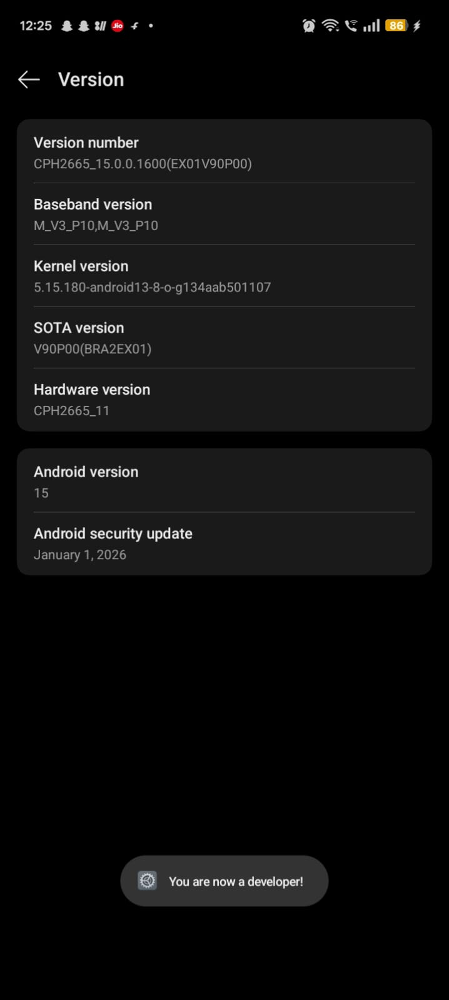
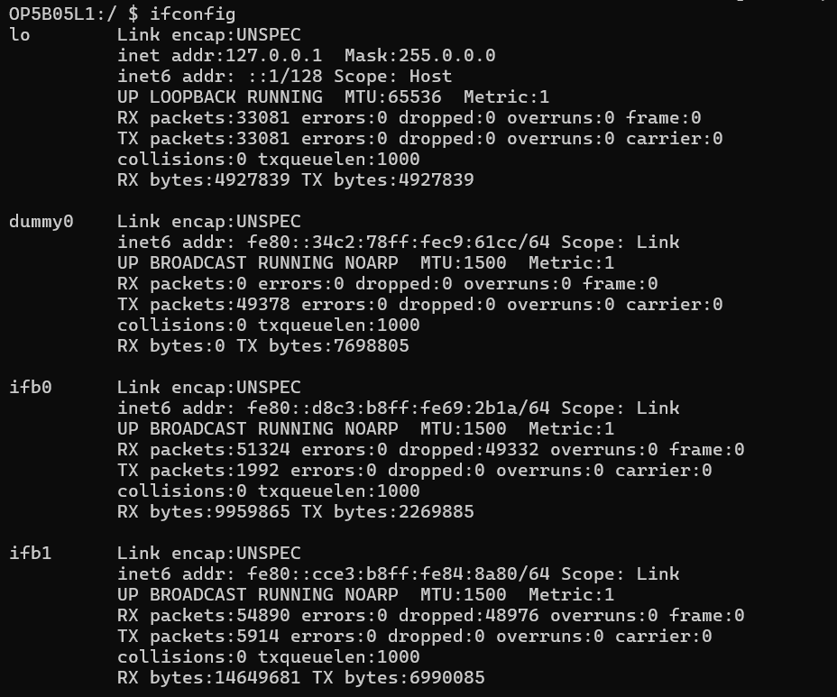
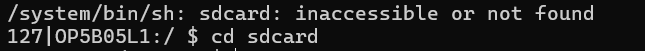
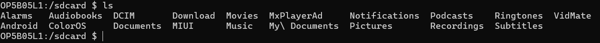
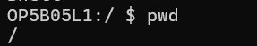
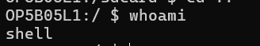
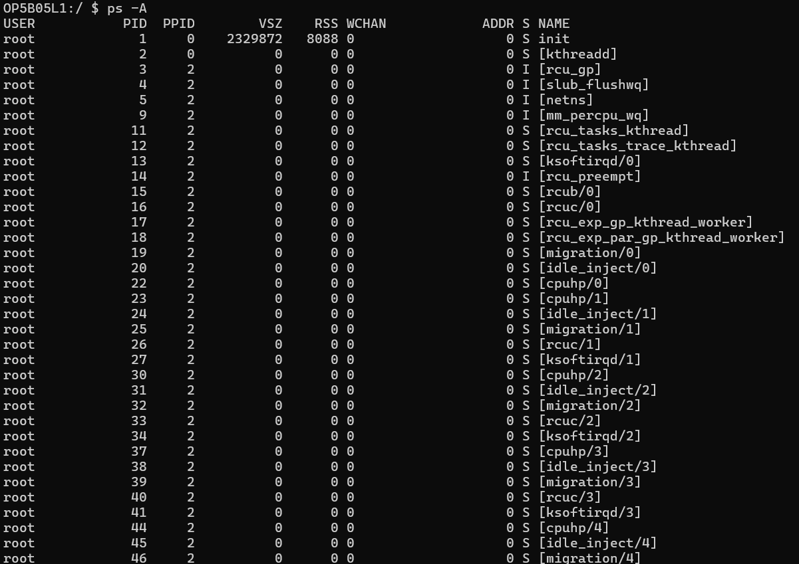
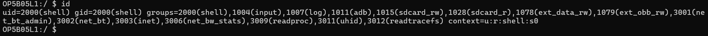

Android Debugging & Shell Access using ADB

Android Debug Bridge wireless connection and shell access project using Kali Linux and Physical devices.

📌 Project Overview

This project demonstrates how to establish a wireless debugging connection with an Android device using ADB and gain shell access for system-level inspection and analysis.

 🎯 Objectives

- Understand how ADB works
- Establish wireless pairing with Android device
- Access Android shell environment
- Execute Linux-based system commands
- Analyze processes and network configuration

🛠 Tools & Environment

- windows (Host System)
- Android Debug Bridge (ADB)
- Physical Android Device: OPPO A3 Pro 5G
- Wireless Debugging Enabled

In a cybersecurity lab environment, a mobile security analyst remotely connects to an Android device to perform system inspection using ADB wireless debugging. Shell access is obtained to examine running processes, user context, and network configuration.

🚀 Implementation Steps
1. Enable Developer Options
- Navigate to Settings → About Phone
- Tap Build Number multiple times
- Enable Developer Mode

️2. Enable Wireless Debugging
- Go to Developer Options
- Enable Wireless Debugging
- Pair device using pairing code

3.Go to Cmd from ADB Platform tool[download from github]

️4. Establish ADB Connection
bash
adb pair <ip>:<port>
adb devices

5. Access Shell:
adb shell

6.Execute Investigation Commands:

commands:
whoami
pwd
ps -A
ip addr

 📸 Project Screenshots

1. About Phone

  

2. Version

  

3. Developer Option

  

4. Wireless Debugging

  

5. ADB Pair

  

6. ADB Devices

  

7. ADB Shell

  

8. Ifconfig

  

9. SD Card

  

10. LS Command

  

11. PWD

  

12. Whoami

  

13. PS -A

  

14. ID Command

  

